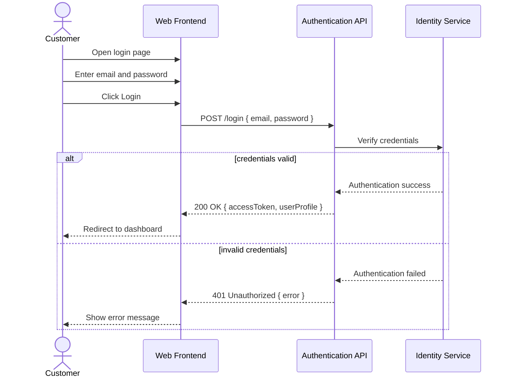

# Solution Design

## Functional Requirements

- Provide an authentication flow that accepts a customer email and password and verifies credentials against the identity service.
- Upon successful authentication, issue a session token or access token and redirect the customer to the banking dashboard.
- Validate email format at the client and server boundary before authentication attempts.
- Validate that the password field is populated and handle empty password submissions gracefully.
- Display error responses for invalid credentials, invalid email format, unregistered email addresses, and missing required fields.
- Support a password recovery entry point by exposing a link that routes the customer to the password recovery flow.
- Provide a registration navigation path for customers who do not have an account.
- Ensure the login endpoint does not reveal whether an email exists in the system to protect account enumeration.

## Non-Functional Requirements

- Authentication response time should be under 1 second for successful logins under normal load.
- Login API should enforce rate limiting to mitigate brute force attacks.
- All authentication traffic must be served over HTTPS and follow secure transport practices.
- The login flow must be accessible and support keyboard navigation and screen readers.
- Failed login attempts and password recovery requests should be logged for security auditing.
- The login feature must be resilient to transient backend failures and surface clear retry guidance if the authentication service is unavailable.

## Technical Assumptions(4-5 bullets)

- The existing system supports token-based authentication (JWT or equivalent) and session management for frontend consumption.
- Password complexity rules and account lockout policies are enforced by the authentication backend and are not defined in the login UI layer.
- Password recovery is handled by a separate flow; this design only requires a password recovery entry point, not the full recovery workflow.
- The frontend uses a client-side router to navigate between login, registration, and password recovery pages.
- Security-sensitive error messaging is minimized to avoid exposing whether an email address is registered.

## Sequence Diagram (Mermaid)



## OpenAPI Specification (YAML)

```yaml
openapi: 3.0.3
info:
  title: Reen Bank Login API
  version: 1.0.0
paths:
  /login:
    post:
      summary: Authenticate customer credentials and issue a session token
      requestBody:
        required: true
        content:
          application/json:
            schema:
              type: object
              properties:
                email:
                  type: string
                  format: email
                  example: user@example.com
                password:
                  type: string
                  format: password
                  example: CorrectHorseBatteryStaple
              required:
                - email
                - password
      responses:
        '200':
          description: Authentication successful
          content:
            application/json:
              schema:
                type: object
                properties:
                  accessToken:
                    type: string
                    description: Token for authenticated session
                  refreshToken:
                    type: string
                    description: Optional refresh token for session renewal
                  userProfile:
                    type: object
                    properties:
                      userId:
                        type: string
                      email:
                        type: string
        '400':
          description: Bad request due to invalid input
          content:
            application/json:
              schema:
                type: object
                properties:
                  error:
                    type: string
        '401':
          description: Authentication failed due to invalid credentials
          content:
            application/json:
              schema:
                type: object
                properties:
                  error:
                    type: string
        '429':
          description: Too many requests due to rate limiting
          content:
            application/json:
              schema:
                type: object
                properties:
                  error:
                    type: string
  /password-recovery/request:
    post:
      summary: Initiate password recovery for a customer email
      requestBody:
        required: true
        content:
          application/json:
            schema:
              type: object
              properties:
                email:
                  type: string
                  format: email
              required:
                - email
      responses:
        '200':
          description: Password recovery request accepted
          content:
            application/json:
              schema:
                type: object
                properties:
                  message:
                    type: string
        '400':
          description: Invalid email format
          content:
            application/json:
              schema:
                type: object
                properties:
                  error:
                    type: string
        '429':
          description: Too many requests due to rate limiting
          content:
            application/json:
              schema:
                type: object
                properties:
                  error:
                    type: string
```

## Error Specification

- 400 Bad Request: Request body missing required fields or email format is invalid.
- 401 Unauthorized: Credentials are incorrect or authentication fails.
- 403 Forbidden: Access denied if account is locked or blocked by security policy.
- 429 Too Many Requests: Rate limiting triggered after repeated authentication attempts.
- 500 Internal Server Error: Unexpected server failure during authentication processing.
- 503 Service Unavailable: Authentication backend or identity service is temporarily unavailable.
